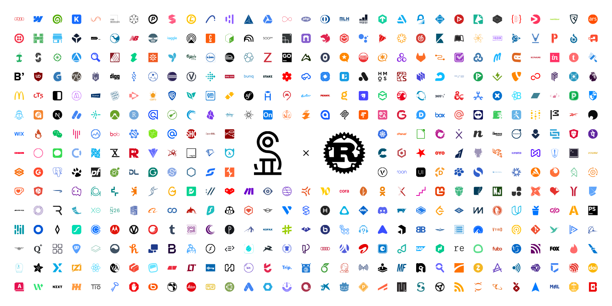

<picture>
  <source media="(prefers-color-scheme: dark)" srcset="./assets/img/simpleicons-rs-banner-dark.png" />
  <source media="(prefers-color-scheme: light)" srcset="./assets/img/simpleicons-rs-banner-light.png" />
  
</picture>

# simpleicons-rs-builder

This repo contain code to generate [simpleicons-rs](https://crates.io/crates/simpleicons-rs).

## build

```bash
git clone https://github.com/cscnk52/simpleicons-rs-builder.git
cd simpleicons-rs-builder
cargo run
```

After build, the crate will generate under `build/crates` folder, run `cargo publish` to publish it.
